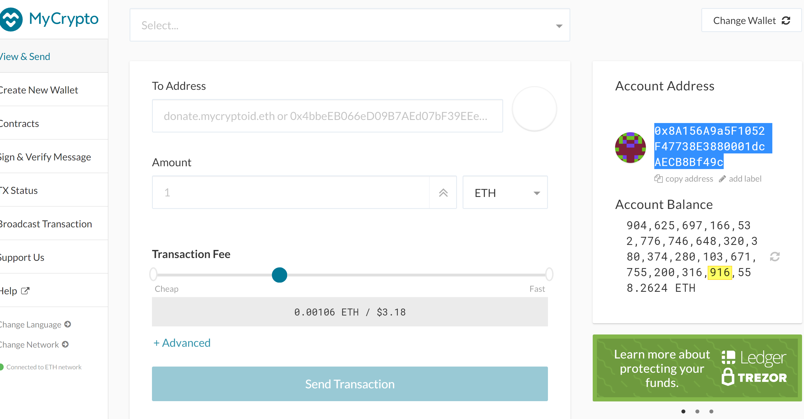

## Wallet Details:

*Wallet Mnemonic phrase: "more allow tissue toy below possible scrap bitter master vintage grab welcome"
*Wallet Address: 0xa3EAA8a973b5E5Ff9efe5e604a8DE1f55Ed2E0CA
*Wallet Private key: 0xdcb25c83ff5527b206886fce7af4e857feb9f0daa82bbdfb10d509fae2818400

## Blockchain POA details:
*Chain Name: tuanpoanet
*Chain ID: 369
*Node 1 Public address of the key:   0x71f9F6B10971ca20b3dFC693D065F206bCEa8Bb9
*Node 1 password (without quotes): password
*Node 2 Public address of the key:   0x8A156A9a5F1052F47738E3880001dcAECB8Bf49c
*Node 2 password (without quotes): password
*node 1 enode://8f82caecad2509865642a1143f822ce07e0a678aad5c545236fc2f8fef3e45e250520d15af6f18ddff4483c6ff84c98436c2fe663f330bbde10ead6807c2c49f@127.0.0.1:30303

## To start the network: 

1. Navigate to `/POA Development Chain/POA Chain` 
2. To start 1st Node - GitBash command: 
    *  ./geth --datadir node1 --unlock "0x71f9F6B10971ca20b3dFC693D065F206bCEa8Bb9" --mine --rpc --allow-insecure-unlock
    * **NOTE:** Type node password and hit enter - even if you can't see it visually!

3. To start 2nd Node - GitBash command: 
    *  ./geth --datadir node2 --unlock "0x8A156A9a5F1052F47738E3880001dcAECB8Bf49c" --mine --port 30304 --bootnodes "enode://8f82caecad2509865642a1143f822ce07e0a678aad5c545236fc2f8fef3e45e250520d15af6f18ddff4483c6ff84c98436c2fe663f330bbde10ead6807c2c49f@127.0.0.1:30303" --ipcdisable --allow-insecure-unlock

    * **NOTE:** Type node password and hit enter - even if you can't see it visually!

4. PRC Port for node 1: 30303 
5. PRC Port for node 2: 30304 

## To connect MyCrypto to `tuanpoanet` network:

* Open the MyCrypto app, then click `Change Network` at the bottom left:

* Click on tuanpoanet:

* Network setup is the below:

## To send a transaction in `tuanpoanet`:

1. Login to Wallet 1:
    
    
    * Wallet 1 password (without quotes): `password`
    
2. Send Transaction:
    * In the `To Address` box, type the public address from Node2 (0x8A156A9a5F1052F47738E3880001dcAECB8Bf49c), then fill in an arbitrary amount of ETH:
    
    
    
    
    
    
    

3. Login to Wallet 2 to confirm the amount:

    * Wallet 2 password (without quotes): `password`
    
    
    
    * **NOTE:** Both wallet was prefunded with 904625697166532776746648320380374280103671755200316906558.262375061821325312 ETH and after the transaction, wallet 2 increased 10000 ETH 

    

